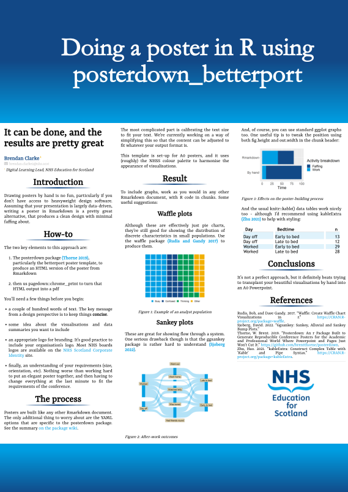

 Conference survival kit in R
================
Brendan Clarke, NHS Education for Scotland, <brendan.clarke2@nhs.scot>
2022-11-11

# Introduction

I love giving talks, but I hate making all the bits and pieces that go
along with them. This repo has some useful bits of R and Rmarkdown to
help simplify the process of producing posters, slides, and other
resources from Rmarkdown.

There’s nothing very original here - it’s really just a collection of
templates that have been customised to simplify. I’m based in NHS
Scotland, so the colours, layout, logos, etc have been tweaked to fit.

# What’s here?

1.  A poster template, with NHS-ish branding, based on
    [posterdown_betterport](https://github.com/brentthorne/posterdown/wiki/posterdown_betterport)
    (added 11/11/2022)

